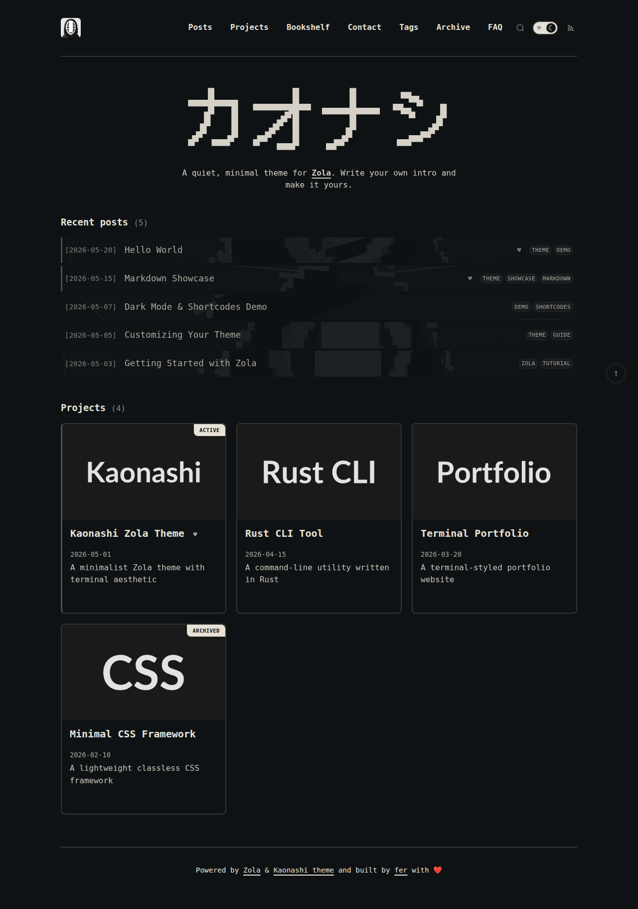

# Kaonashi — Zola Theme



A minimalist Zola theme with a terminal-inspired aesthetic. Dark/light mode, card-based project grids, monospace typography, client-side search, privacy-friendly analytics, and fully responsive design.

> [Live demo](https://fer.github.io/zola-theme-kaonashi) · [GitHub](https://github.com/fer/zola-theme-kaonashi)

## Installation

```sh
# In your Zola site root
git submodule add https://github.com/fer/zola-theme-kaonashi themes/zola-theme-kaonashi
```

Then enable the theme in `zola.toml`:

```toml
theme = "zola-theme-kaonashi"
compile_sass = true
```

## Optional: Sample content

To see the theme in action immediately, copy the `content/` directory from this repository into your project root:

```sh
cp -r themes/zola-theme-kaonashi/content .
```

This adds sample posts, projects, bookshelf entries, and pages — ready-to-use with matching frontmatter. You can edit or replace them later.

## Configuration

The theme reads these values from `zola.toml`:

```toml
base_url = "https://example.com"
theme = "zola-theme-kaonashi"
compile_sass = true
title = "My Site"
description = "A description shown in the hero section"

[extra]
author = "Your Name"
bio = "A short bio shown on the homepage."

[extra.social]
github = "https://github.com/you"
email = "mailto:you@example.com"
rss = "/rss.xml"
```

```toml
# Enable search (requires client-side JS)
build_search_index = true

# Enable tag taxonomy
taxonomies = [
  {name = "tags", feed = true},
]

[extra.analytics]
provider = "goatcounter"
goatcounter_code = "YOUR_CODE"  # Sign up at goatcounter.com
```

| Key | Purpose |
|---|---|
| `config.description` | Hero subtitle on the homepage |
| `config.author` | Display name in hero heading and post bylines |
| `config.extra.bio` | Bio paragraph shown in the homepage details section |
| `config.extra.social.github` | GitHub link in the site footer |
| `config.extra.social.email` | Email link |
| `config.extra.social.rss` | RSS feed link |
| `build_search_index` | Enables client-side search index |
| `[taxonomies]` | Enables `/tags/` tag cloud and per-tag listing pages |
| `[extra.analytics]` | GoatCounter analytics (set code to activate) |
| `[extra.show_posts]` | Show recent posts on homepage |
| `[extra.show_projects]` | Show project cards on homepage |
| `[extra.logo]` | Custom logo path (default `/images/logo.svg`) |

### Theme variables

Customize colors, typography, and layout without touching SCSS. Add an `[extra.theme]` section to your `zola.toml`:

```toml
[extra.theme]
body_bg_dark = "#0f1214"
body_color_dark = "#e6e2d6"
color_border_dark = "#333"
body_bg_light = "#e9e9e8"
body_color_light = "#1a1a1a"
color_border_light = "#ddd"
body_font_family = "monospace, 'Courier New', Courier"
display_font_family = "'DotGothic16', monospace"
site_max_width = "900px"
border_thickness = "0.125rem"
```

| Key | Default | Purpose |
|---|---|---|
| `body_bg_dark` | `#0f1214` | Background color in dark mode |
| `body_color_dark` | `#e6e2d6` | Text color in dark mode |
| `color_border_dark` | `#333` | Border color in dark mode |
| `body_bg_light` | `#e9e9e8` | Background color in light mode |
| `body_color_light` | `#1a1a1a` | Text color in light mode |
| `color_border_light` | `#ddd` | Border color in light mode |
| `body_font_family` | `monospace, 'Courier New', Courier` | Base font stack |
| `display_font_family` | `'DotGothic16', monospace` | Font for the hero display text |
| `site_max_width` | `900px` | Max width of the content wrapper |
| `border_thickness` | `0.125rem` | Thickness of all borders |

Full theme variable reference is available in the [demo config](zola.toml).

## Content structure

```
content/
├── posts/           # Blog posts
├── projects/        # Projects — card grid layout
├── bookshelf/       # Book reviews — card grid + metadata sidebar
├── search.md        # Search page (uses search.html template)
├── archive/
│   └── _index.md    # Year-grouped post archive
├── contact/
├── faq/
└── 404.md
```

The **homepage** renders a hero/splash section using values from `zola.toml`, followed by post and project card grids. Sections under `/projects/` automatically get the **card grid layout** with splash images and tags. Sections under `/bookshelf/` render as a card grid with a metadata sidebar on each book page. All other sections render as a simple row-based list.

## Page frontmatter

```toml
+++
title = "My Page"
description = "Shown in cards and as a page excerpt"
date = "2026-05-01 12:00:00"

[taxonomies]
tags = ["zola", "theme"]

[extra]
splash = "/images/cover.jpg"    # Optional hero image and list background
pinned = false                  # Set true to pin at top of lists
show_toc = true                 # Show/hide table of contents (default: true)
+++
```

| Field | Purpose |
|---|---|
| `title` | Page title |
| `description` | Shown in cards and as a page excerpt |
| `date` | Publication date |
| `taxonomies.tags` | Array of tags that link to `/tags/<tagname>/` pages |
| `extra.splash` | Hero image on pages, background image in post lists, card image in grids |
| `extra.pinned` | Pin to top of post/project listings |
| `extra.show_toc` | Show/hide the table of contents sidebar (default true) |

Bookshelf pages also support `extra.author`, `extra.publisher`, `extra.year`, `extra.isbn`, `extra.rating`, and `extra.url` for the metadata sidebar.

## Features

- **Dark/light mode toggle** — Persisted to localStorage, defaults to OS preference. Animated sun/moon toggle in header.
- **Client-side search** — Full-text search via elasticlunr. Accessible from the header search icon or `/search/`. Press `/` to jump to search from any page.
- **Tag taxonomy** — Proper Zola taxonomies with `/tags/` cloud page and per-tag listing pages.
- **Archive page** — `/archive/` lists all posts grouped by year with month-day dates.
- **Pinned posts** — Set `extra.pinned = true` to float a post or project to the top of listings.
- **Terminal aesthetic** — Monospace typography with a blinking `█` cursor on titles, retro dark palette.
- **Code blocks** — Language label, copy button, and automatic line numbers. Zebra-striped alternating lines.
- **Code line highlighting** — Highlight specific lines via a `<div data-highlight="...">` marker before any fenced code block.
- **Rich shortcodes** — YouTube embeds (privacy-enhanced), figures with captions, HTML5 audio player, obfuscated email links, collapsible details and FAQ sections, Mermaid diagrams.
- **Email obfuscation** — Spam-protected email display that decodes via JavaScript.
- **Book metadata sidebar** — Bookshelf pages render a sticky sidebar with cover image, author, publisher, year, ISBN, star rating, and link.
- **Project card grid** — Responsive auto-fill grid with grayscale-to-color hover transitions.
- **Back to Top** — Fixed circular button in bottom-right corner.
- **Mermaid diagrams** — Render flowcharts, sequence diagrams, and more using the `mermaid` shortcode.
- **Active TOC tracking** — The table of contents sidebar highlights which heading is currently in view.
- **Privacy-friendly analytics** — Optional GoatCounter integration (no cookies, open source).
- **Responsive design** — Breakpoints at 600px and 900px. Collapsed nav on mobile.
- **TOML-configurable theming** — Colors, fonts, max width, and border thickness set in `zola.toml`.
- **Atom feed** — RSS/Atom feed at `/posts/atom.xml`.
- **Sitemap & robots.txt** — Auto-generated.
- **Custom 404** — Bundled error page.
- **Favicon variants** — Multiple favicon sizes, apple-touch-icon, and web manifest for PWA-ready sites.

## Shortcodes

The theme bundles seven shortcodes for rich content.

### YouTube

Embed a privacy-enhanced YouTube video (uses youtube-nocookie.com):

{{ youtube(id="dQw4w9WgXcQ") }}

### Image with caption

Render a `<figure>` with optional `<figcaption>`:

{{ image(src="/images/logo.png", alt="Logo", caption="The site logo") }}

Omit `caption` to render a plain ``.

### Audio

HTML5 audio player:

{{ audio(src="/audio/episode.mp3") }}

Optionally set `type` (default `audio/mpeg`).

### Email (obfuscated)

Spam-protected email that decodes via JavaScript:

{{ email(address="hello@example.com") }}

Bots see `[email protected]`; humans get a clickable `mailto:` link.

### Details (collapsible)


Hidden content revealed on click. Supports **markdown**.


### FAQ

Collapsible FAQ items inside a bordered container. Wrap multiple in a `<div class="faq">` or use standalone:


Zola is a fast static site generator written in Rust.


### Code Block with highlighted lines

Place a `<div data-highlight="...">` marker immediately before any fenced code block:

````html
<div data-highlight="2,4-6"></div>

```rust
fn main() {
    let x = 1;
    let y = 2;
    let z = x + y;
    println!("{}", z);
}
```
````

Use comma-separated line numbers and ranges (e.g., `"1,3-5"`). The marker is consumed by JavaScript at runtime.

### Mermaid Diagrams

Render flowcharts, sequence diagrams, class diagrams, and more:


graph TD
    A[Markdown] --> B[Zola Build]
    B --> C[Static HTML]


## License

MIT
